# FastCGOL
... work in progress ...

( this is an extension of my initial cellular automaton project found here https://github.com/TroiMakesGames/ConwaysGOL )

Exploring different methods of optimisation for grid based cellular automaton systems with 8 neighbors (using the rules of Conway's Game of Life), specificaly logic/CPU/GPU/shader optimisations using the following languages and frameworks:
- Python Pygame
- JavaScript HTML Canvas
- C++ Raylib (+ multithreading)
- C# OpenTK (.NET OpenGL wrapper for C#) (+ GPU/shader accelaration)

# Graphs and observations (Work in progress)

## full

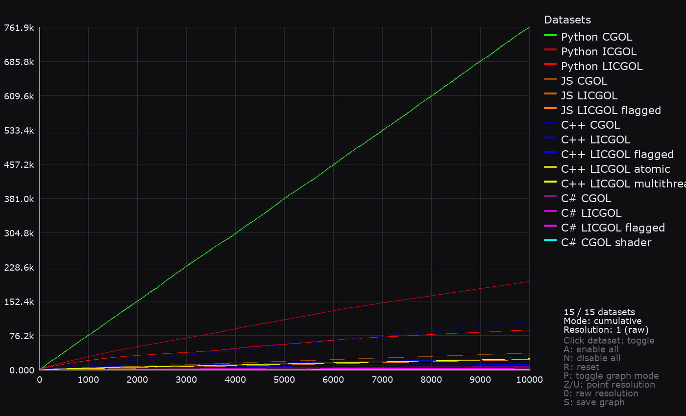

## full res 200

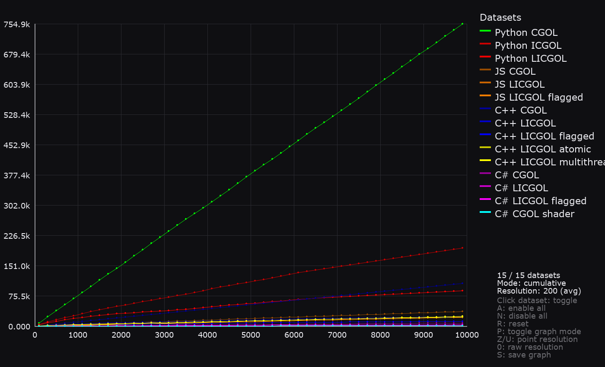

## pp all res 200

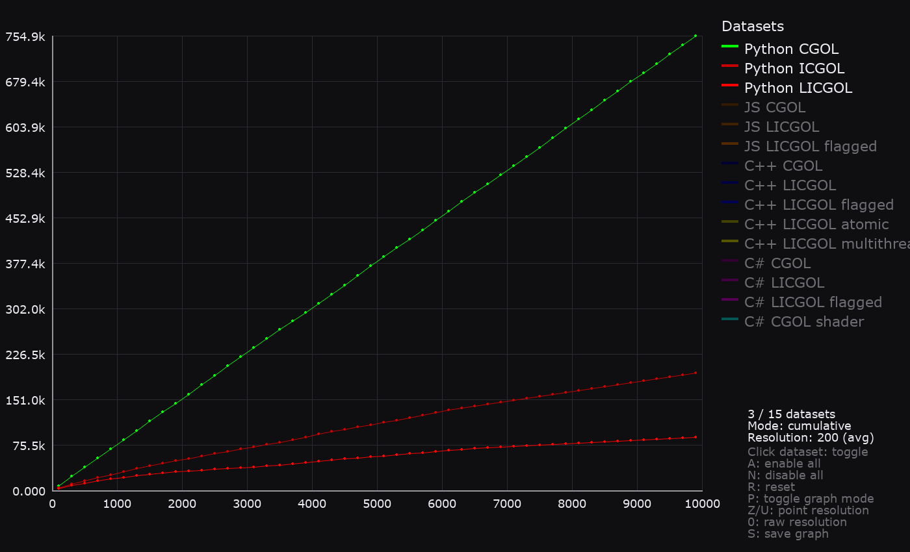

## cr + js overlap res 200

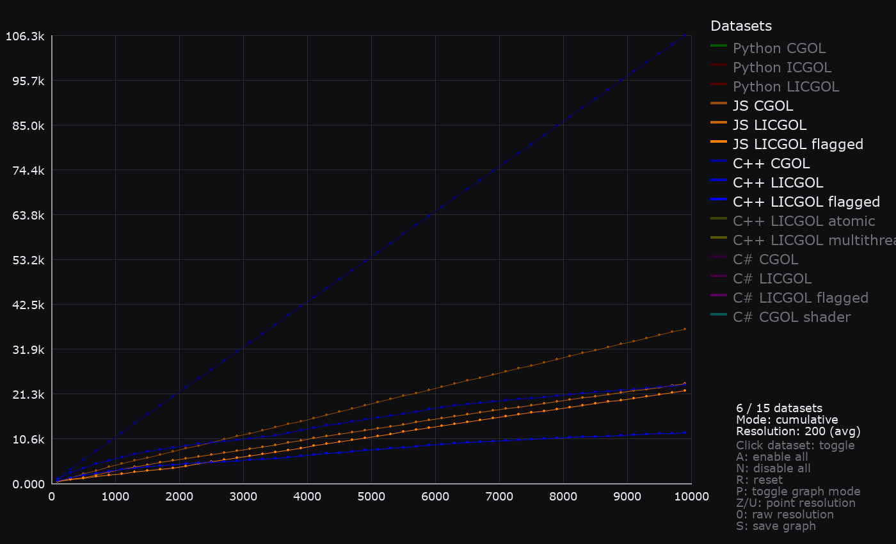

## cr + mutli + js overlap res 200

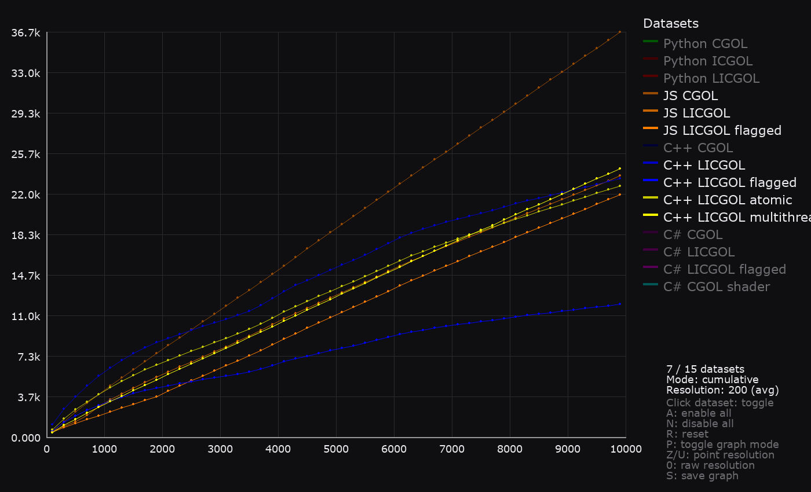

## cr flagged + c# all res 200

## best pp opt = worst cr

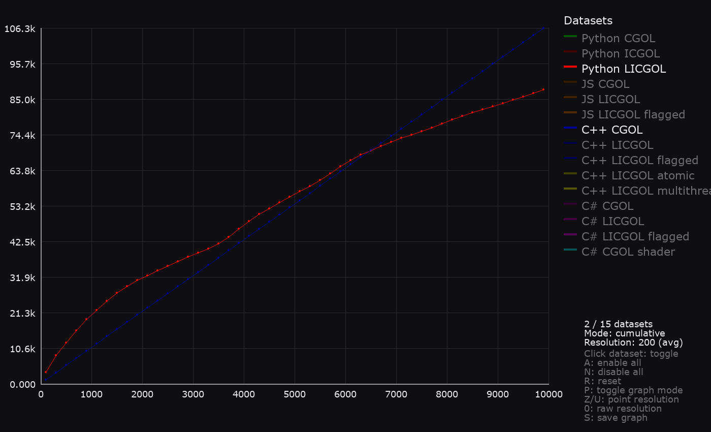

<!-- Per iteration graphs -->

## periter full

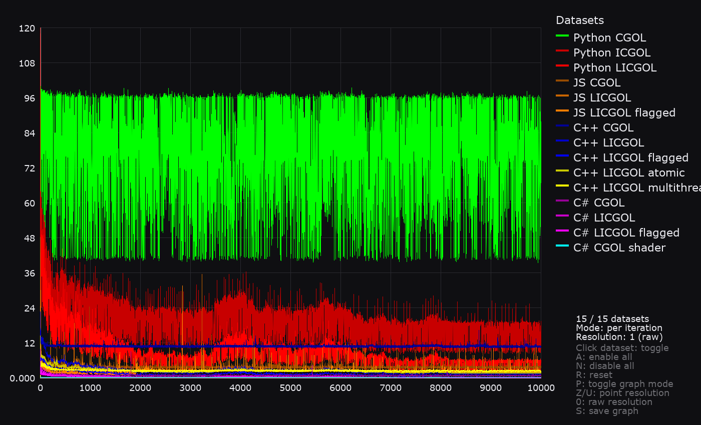

## periter full res 200

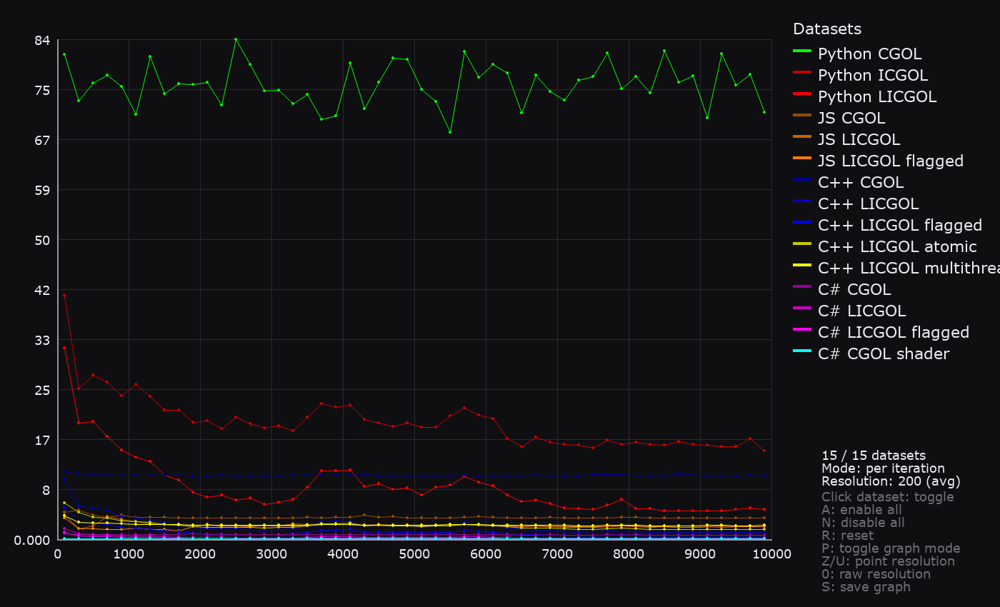

## periter pp all res 200

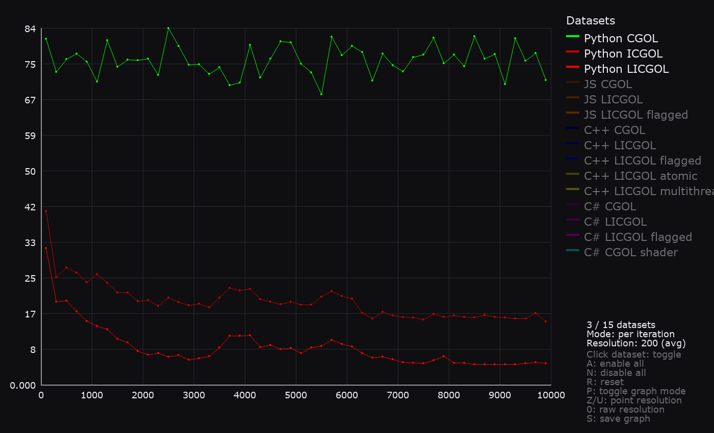

## cr vs pp stability

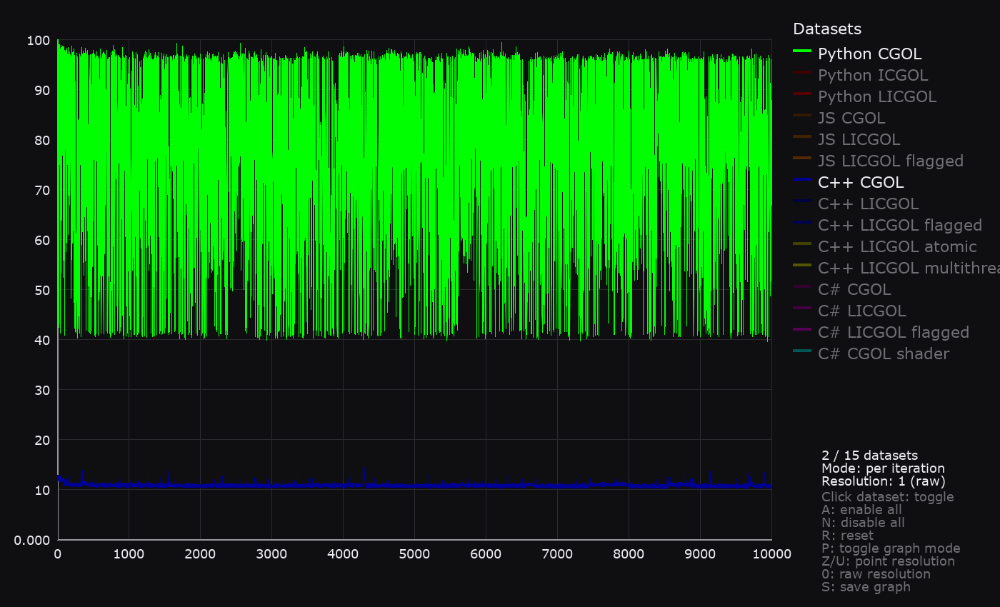

## cr vs js stability

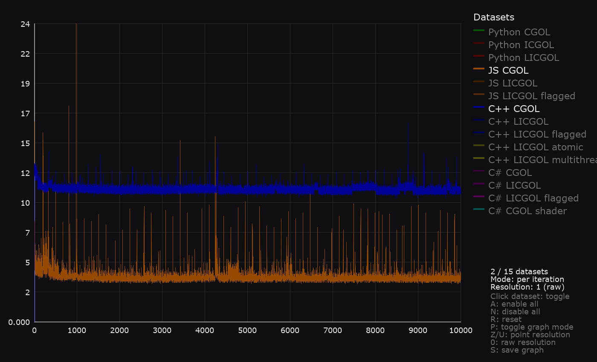

## cs shader benchmark groupin

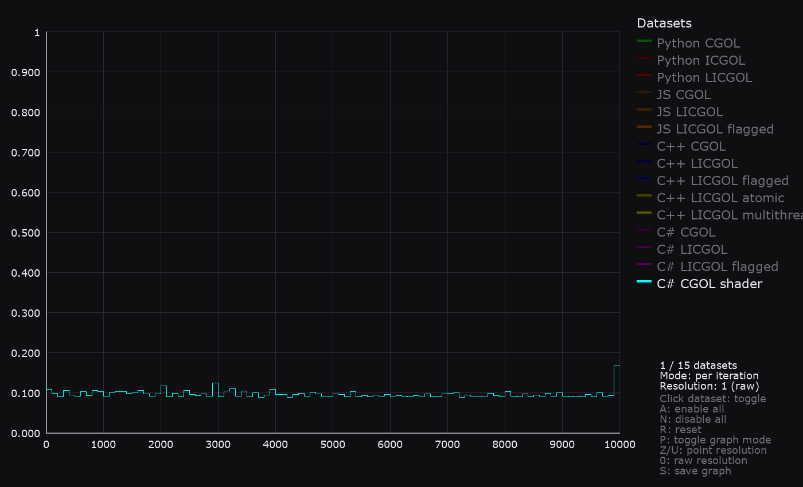

## cs shader vs cs flagged overtake

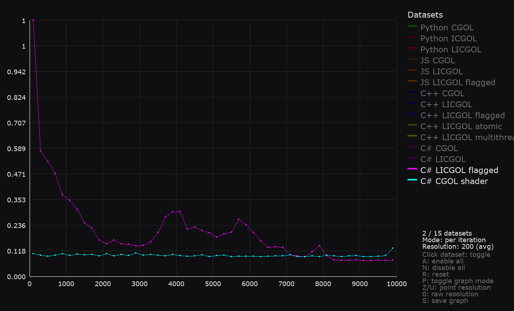

